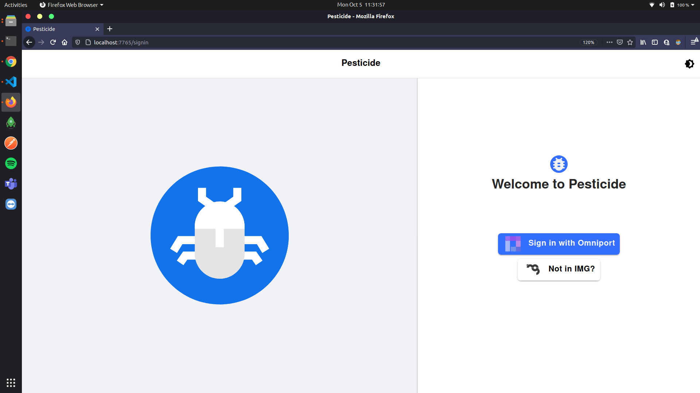
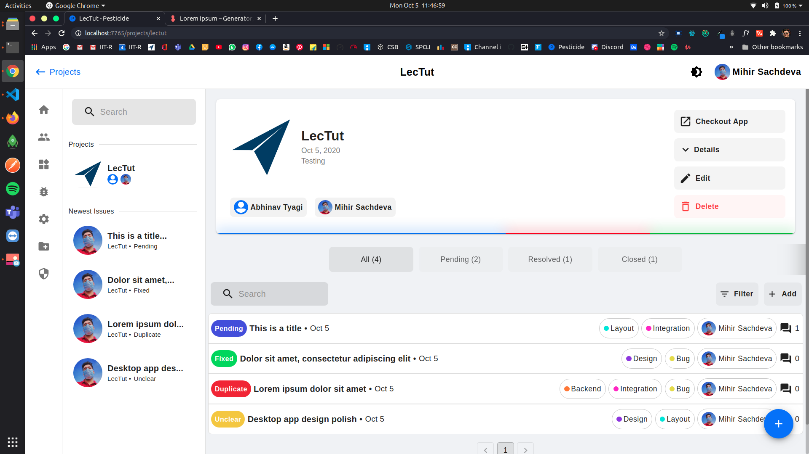
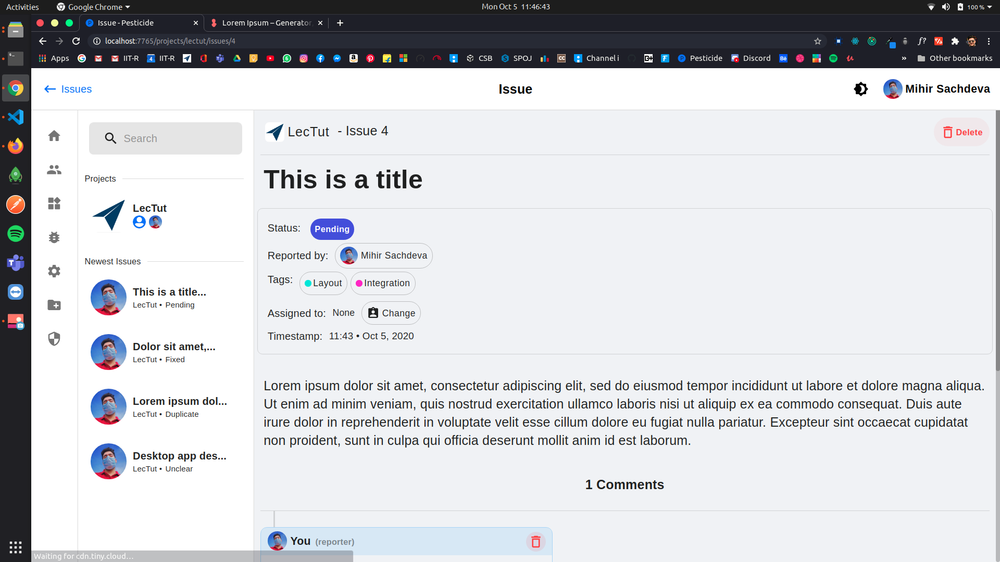
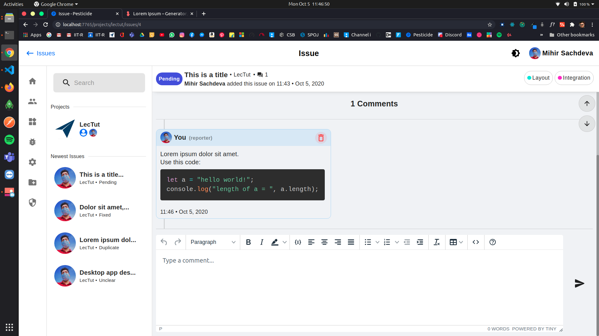

# Pesticide

## A clean and feature-rich project-management and bug-tracking app.







### View more screenshots [here](./readme-assets/images)

Backend: [Django](https://www.djangoproject.com), with [DjangoREST](https://www.django-rest-framework.org) for APIs, and [Django Channels](https://channels.readthedocs.io/en/latest/) for real-time comments.

Frontend: [React](https://reactjs.org/), with [Material-UI](https://material-ui.com/) and [Redux](https://react-redux.js.org/) for state management.

Database management: [MySQL](https://www.mysql.com/). Simple, just works.

Frontend build files are served with [NGINX](https://www.nginx.com/), with proxy_pass for requests to the backend.

Containerized using [Docker](https://www.docker.com/), with [docker-compose](https://docs.docker.com/compose/) for container orchestration.

Made for [IMG IIT Roorkee](https://img.channeli.in) Developers' Summer Project of 2020.

## Make Pesticide Your Own!

### Clone this repository

Open your terminal in a folder of your choice (where you would want to store your repository.) For example, if you want to clone this project in the Home (~) directory, enter the following command:

```bash
user@system:~$ git clone https://github.com/MihirSachdeva/pesticide-docker.git
```

Then move to the newly formed directory called `pesticide-docker`

```bash
user@system:~$ cd pesticide-docker
```

## Set Up The Codebase

## Configuration

The file [base_template.yml](pesticide_backend/src/config/base_template.yml) is the template file for all the required variables needed to run the Django backend. This includes fields such as language code and timezone of the app, secret key, client id and client secret given by Omniport OAuth Dashboard, email parameters, and database variables. More detail information of these keys have been given in a table below. The [settings.py](pesticide_backend/src/pesticide/settings.py) file will look for the values of these parameters in a file named `base.yml` in the [config](pesticide_backend/src/config/) directory.
Make a new file named `base.yml` in the same [config](pesticide_backend/src/config/) directory as [base_template.yml](pesticide_backend/src/config/base_template.yml) and then copy the contents of the file [base_template.yml](pesticide_backend/src/config/base_template.yml) into `base.yml`. Then fill all the fields in `base.yml` and hit save.

### **i18n**

| key           | meaning                                              |
| ------------- | ---------------------------------------------------- |
| language_code | Language code of the app, eg. `en-us`, `en-gb`, etc. |
| timezone      | Time zone of the app, eg. `Asia/Kolkata`, etc.       |

### **keys**

| key           | meaning                                                                                           |
| ------------- | ------------------------------------------------------------------------------------------------- |
| secret_key    | Secret key required in [settings.py](pesticide_backend/src/pesticide/settings.py) (50 characters) |
| client_id     | Client ID you obtained from the Omniport Channel i dashboard                                      |
| client_secret | Client secret key you obtained from Omniport Channel i dashboard                                  |
| redirect_uri  | One of the redirect URIs you have registered on the Omniport Channel i dashboard                  |
| desired_state | Any string that you want the `REDIRECT_URI` to receive on success                                 |

### services > **email**

| key                 | meaning                                                                              |
| ------------------- | ------------------------------------------------------------------------------------ |
| email_host          | Your emailing service host (like Google's `smtp.gmail.com`)                          |
| email_port          | Your emailing service port (like `587`)                                              |
| email_host_user     | Your emailing service email id                                                       |
| email_host_password | Your emailing service account password                                               |
| email_use_tls       | This tells Django what secure protocol should be used to connect to the email server |

### services > **database** (values must be same as those in [docker-compose.yml](docker-compose.yml))

| key      | meaning                       |
| -------- | ----------------------------- |
| host     | Your database host            |
| port     | Your database port            |
| user     | Your database user's username |
| password | Your database user's password |
| name     | Database name                 |

### pagination

| key       | meaning                                        |
| --------- | ---------------------------------------------- |
| page_size | Your preferred size of items in a page, eg. 10 |

### dev

| key              | meaning                                                      |
| ---------------- | ------------------------------------------------------------ |
| allow_all        | To allow anyone (outside of IMG) to use the app, eg. `false` |
| allow_any_master | To make everyone master of the app (admin), eg. `false`      |

### frontend

| key | meaning                                  |
| --- | ---------------------------------------- |
| url | App frontend url, eg. `http://localhost` |

## Build the required images

Build the required images, such as pesticide-docker_backend, pesticide-docker_frontend, redis, nginx, mysql and node using dockere-compose.

```bash
user@system:~/pesticide-docker$ docker-compose build
```

## Start the containers

Run all the relevant containers using docker-compose.
NOTE: Make sure that the port 80 is not used by any other service, as we are port forwarding the port 80 of the system to port 8080 of the container.

```bash
user@system:~/pesticide-docker$ docker-compose up
```

Then head over to `http://localhost` to start using the app!

The Django admin can be viewed at `http://localhost/django-admin/`.

The Django REST API pages can be viewed at `http://localhost/api/`.

## How to stop the containers

Stop the running containers using docker-compose.

```bash
user@system:~/pesticide-docker$ docker-compose down
```

## Contributing

Pull requests are welcome. For major changes, please open an issue first to discuss what you would like to change.
